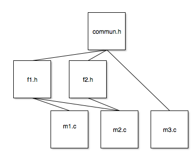

# Systèmes d'exploitation

###  Introduction / Rappels

### Gestion des processus

- Création/Suppression/Cycle de vie
- Ordonnancement
- Communication
- Synchronisation

### Gestion des E/S

### Gestion de la mémoire

- Pagination
- Mémoire virtuelle

---

## Introduction / Rappels

### Rappels sur le langage

**1) Structuration d'un programme**

Fichier .h (header)
Contient :
* Prototypes (signatures, profiles) de fonctions.
* Directives de pré-processeur.  
  * inclusions #include
  * def macro #define
  * compilation conditionnelle #if
* Définition de types "utilisateur"

Ex :
```c
struct Complexe {
    double re;
    double im;
};
```
-> Type "struct Complexe"
```c
typedef struct Complexe {
    double re;
    double im;
}z;
```
-> Variable "z" de type anonyme  
-> type "z"

* Déclaration de variables externes

Fichier .c (source)  
Contient :
* Inclusions de .h
* Corps de fonctions
* Déclarations de variables

#### Statuts des variables

extern ,static, automatic, register (obsolète)

-> extern

-> automatic (par défaut)  
* portée
  * define inter{} : l'instruction composée
  * main : globale
* durée de vie
  * exéc instruction composée
  * tout le programme

-> static  

moyen de "garder la mémoire" de notre programme  
initialisation de variable statique se fait dans le tas (avant l'appel de la fonction main).  

* portée
  * id auto
  * l'unité de compilation
* durée de vie
  * tout le programme

Production du programme



```c
#ifdef __COM__H
#define __COM__H
#endif
```


protège le .h de l'inclusion multiple

make <- makefile
* déclaration de variable
* commentaire
* lignes de dépendance
* commandes système

OBJ = m1.o m2.o m3.o

```make
m1.o : m1.c df1.h com.h
    cc -c m1.c
m2.o : m2.c f1.h f2.h com.h
    cc -c m2.c
m3.o : m3.c com.h
    cc -c m3.c
monProg : m1.o m2.o m3.o
    cc -o monProg m1.o m2.o m3.o
depend :
    sed '/"#DEP/q' makefile > mk.tmp
    cc -M *.c >> mk.tmp
    mv mk.tmp makefile

#DEPENDANCES : NE PAS DETRUIRE
```

On utilise une pseudo cible qui s'appelle depend.  
A chaque fois qu'on modifie l'architecture de notre programme on fait make depend.


**2) Pointeurs et tableaux**  

* Définition d'un pointeur
```c
    typedef Truc;
    Truc t, *p, *p2;
```
* Initialisation
```c
    p = &t;
    p2 = (Truc*)malloc(sizeof(Truc));
```

! En C il n'existe qu'un seul mode de passage de paramètre (par valeur). => On ne peut JAMAIS provoquer d'effet de bord sur les processus d'un fonction.

Ex
```c
void tripler(int i)}{
    i *= 3;
}
int main(){
    int a = 2;
    tripler(a);
    printf("%d\n", a);
    return 0;
}
```

On fait donc :

```c
void tripler(int i)}{
    (*i) *= 3;
}
int main(){
    int a = 2;
    tripler(&a);
    printf("%d\n", a);
    return 0;
}
```

Les pointeurs permettent de simuler un passage de paramètre par référence qui n'existe pas en C

La notion de tableau ne fait pas partie du langage C.
Le compilateur ne connait pas la notion de tableau, en revanche il connait les pointeurs.

**3) Pointeurs sur fonctions**

-> Tableau de N fonctions,
demander à l'utilisateur quelle fonction lancer.

```c
i = -1
while (i < 0 || i>=N) {
    demander i;
switch(c){
    case 0: fo(); break;
    case N-1: fn-1(); break;
}
}
```

**Idée** : assimiler la notion de fonction à un type afin (notamment) de passer des fonctions en paramètre d'autres fonctions.

**Définition** :

```c
double somme(double x, double y){
    return x*y;
}
double produit(double x, double y){
    return x*y;
}
```

```c
typedef double(*fonction)(double, double);
fonction tab[] = {somme, produit, ...};
i = -1;
while (i<0 || i >= sizeof(tab)/sizeof(fonction)){
    scanf("%d", &i);
}
tab[i](a, B);
```

**Exercice :**
1.  Ecrire une fonction de recherche dichotomique (générique) dans un tableau quelconque.
2. Ecrire un programme de test de cette fonction.

infos nécessaires :
- le tableau
- int d'elements
- valeur cherchée
- critère de comparaison
(strcmp)
  * 0 si l1 == er
  * inf à 0 si l1 < l2
  * sup à 0 si l1 >l2


```c
int iSearch(int *tab, int nbElts, int val){
    int i;
    if (nbElts == 0){
        return 0;
    }
    if(nbElts == 1){
        return tab[0] == val;
    }
    i = nbElts/2;
    if(val == tab[i]){
        return 1;
    }
    if(val < tab[i]){
        return iSearch(tab i, val);
    }
    return iSearch(tab+i, nbElt-i, val);
}
```

```c
int genSearch(void *tab, int nbElts, void *val, int eltSize, int (*comp)(int *, int *)){
    if (nbElts == 0){
        return 0;
    }
    if (nbElts == 1){
        return !comp(tab, val);
    }
    i = nbElts/2;
    if(!comp(id, tab+(i*eltSize))){
        return 1;
    }
    if(comp() < 0){
        return geoSearch(tab, c, val, eltSize, comp);
    }
    return genSearch(tab+i*eltSize, nbElts-i-1, int, eltSize, comp);
}
```

```c
int main(){
    int t1[] = {1, 2, 4, 5, 7, 8};
    char* t2[] = {"amour", "belle", "marquise", "mourir"};
    printf("%d %d %d %d\n", genSearch(1, 6, tab+4, sizeof(int), comp));
    genSearch(1, 6, manqueuntruc, ...)
    genSearch(2, 4, t2+2, sizeof(char *), sComp);
    genSearch(2, 4, manqueuntruc, ...));
}
```

___

Remerciements à Philippe Laroque pour ce cours.
